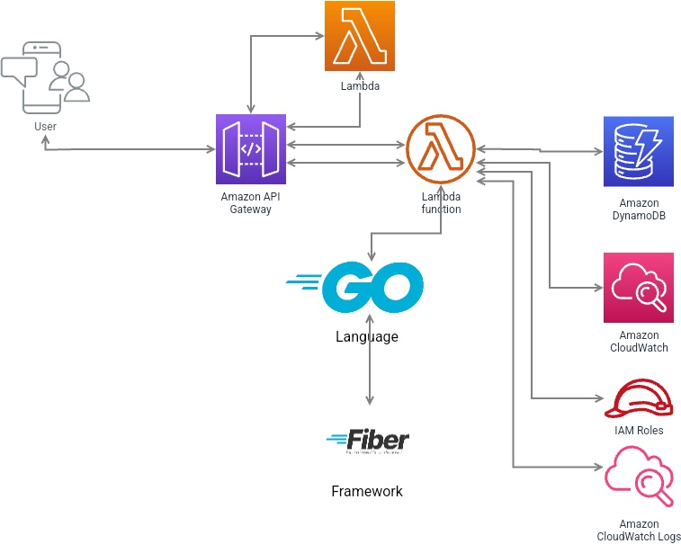

# isfree backend

This project uses AWS Lambda and Go Fiber together which is a very unique combination and was a very interesting and fun experience to make.

## AWS Lambda
AWS Lambda is a serverless computing service that lets you run code without provisioning or managing servers.
We chose AWS Lambda because it runs our code on a highly available compute infrastructure and performs all compute resource management, including server and operating system maintenance, capacity provisioning and automatic scaling, code and security patch deployment, and logging.

## Amazon API Gateway
Amazon API Gateway is a service that lets you create, publish, and manage APIs for your applications. It is used to serve as an entry point to the API so that users can communicate with Lambda functions.

## Amazon DynamoDB
Amazon DynamoDB is a fully managed NoSQL database service that delivers fast, predictable performance with seamless scalability. It is used for storing and retrieving data and the basic role of DB, and can be said to be a core component of a serverless backend.

## Go Language
Go Language is a programming language developed by Google that is gaining a lot of attention and popularity these days thanks to its efficiency and simplicity. This time, I used it to write the backend code.

## Fiber Framework
Fiber is Go's web framework, inspired by nodejs's Express, and equipped with Golang's fasthttp on top. fiber is designed for rapid development with zero memory allocation and performance in mind. Due to these features, I decided to use Fiber Framework this time.

## Amazon CloudWatch
Amazon CloudWatch was used to catch errors that were made after deploying it to aws lambda and testing it.

## IAM Roles
Used IAM Roles to efficiently collaborate with our team.

# Build Project
You need to go to root directory of the project.  
After that you need to run the below command
```shell
GOARCH=amd64 GOOS=linux go build main.go
zip -jrm main.zip main
```
After this you would be able to see main.zip file.  
You could now use this file to upload to use AWS Lambda.